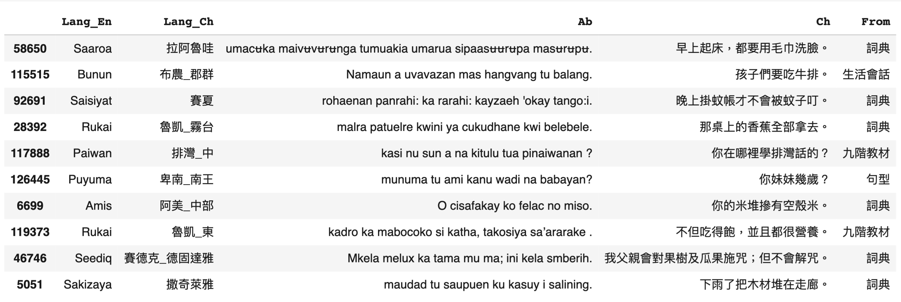
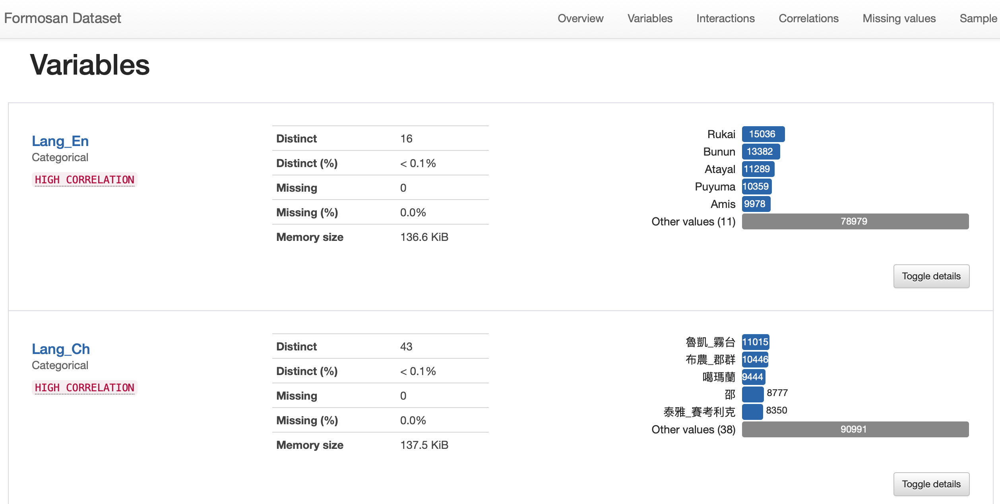

# 台灣南島語-華語句庫資料集
(Dataset of Formosan-Mandarin sentence pairs)

[點我](https://share.streamlit.io/howard-haowen/formosan-languages/main/app.py)進入互動式查詢系統

## 資料概要
- 🎢 資料集合計約13萬筆台灣南島語-華語句對
- ⚠️ 此查詢系統僅供教學與研究之用，內容版權歸原始資料提供者所有
- 💻 隨機顯示10筆資料

## 資料來源
- 以下資料經由網路爬蟲取得。
   + 🥅 九階教材: [族語E樂園](http://web.klokah.tw)
   + 💬 生活會話: [族語E樂園](http://web.klokah.tw)
   + 🧗 句型: [族語E樂園](http://web.klokah.tw)
   + 🔭 文法: [臺灣南島語言叢書](https://alilin.apc.gov.tw/tw/)
- 詞典資料使用`PDFMiner` 將2019版的PDF檔轉成HTML，再用`BeautifulSoup`抓取句對，偶爾會出現族語跟華語對不上的情形。若發現錯誤，請[聯絡我📩](https://howard-haowen.rohan.tw/)。詞典中重複出現的句子已從資料集中刪除。
   + 📚 詞典: [原住民族語言線上詞典](https://e-dictionary.apc.gov.tw/Index.htm?fbclid=IwAR18XBJPj2xs7nhpPlIUZ-P3joQRGXx22rbVcUvp14ysQu6SdrWYvo7gWCc)

## 統計報告
- 💻 點擊下面的預覽圖即可進入統計報告互動式查看頁面。報告中新增`word_counts`欄位，計算族語句子的字數。

***

